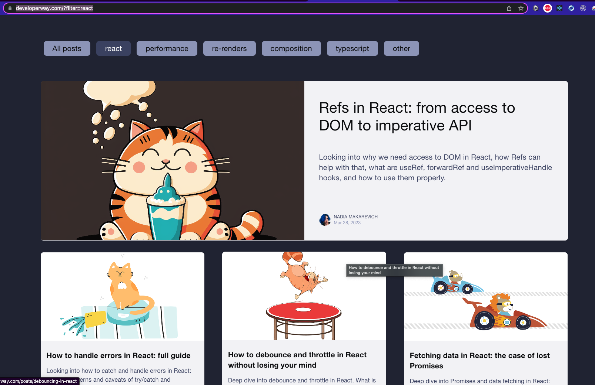

# Miscellaneous Resources     

This is a personal collection of all the resources, tutorials and blogs that I come across and don't have time to read them right away. So I keep the links here so that I can come back again and again to read and learn stuff from here. 
     

 

<h2>Front-end Libraries</h2>

   

<h3> React: </h3>
    

1. [developerway.com](https://www.developerway.com/?filter=react).   
###### tags: `frontend` `react` `blog` 

    

2. [Interactive way to learn React](https://react.gg/?s=visualized)       
###### tags: `interactive` `react` `visualisation` `fun` 
    

3. [The most common React Design Patterns-Part1](https://www.linkedin.com/pulse/most-common-react-design-patterns-baqir-nekfar/)    
[The most common React Design Patterns-Part2](https://www.linkedin.com/pulse/most-common-react-design-patterns-part2-baqir-nekfar/)    
###### tags: `Design Pattern` `react` `Blog` 

4. [Thinking in React](https://react.dev/learn/thinking-in-react)

5. [A Complete Guide to Routing in React](https://hygraph.com/blog/routing-in-react)

  

<h3> JavaScript Libraries </h3>

<h3> P5.js: </h3>   

1. [p5.js](https://p5js.org/)     

###### tags: `opensource` `animation` `creative design/coding` `interactive graphics` `data visualization`   

<h5>Brief description about p5.js from ChatGPT</h5>

It is a JavaScript library that makes it easy to create interactive graphics and animations in a web browser. p5.js is based on the Processing programming language and provides a simple and intuitive API for creating and manipulating graphics, sounds, and interactivity. 

With p5.js, you can create animations, generative art, games, data visualizations, and other interactive projects directly in your web browser using JavaScript. The library is open source and has a large community of users and contributors, which means there are many resources and examples available to help you get started and learn more about p5.js.    

   
 
    

2. [Typing and Deleting Effect](https://usefulangle.com/post/75/typing-effect-animation-javascript-css)     

3. [Typewriter Effect](https://www.npmjs.com/package/typewriter-effect)

4. [Cool Animation for Login](https://codepen.io/m3eu/pen/VwYBbwO)    

5. [Javascript Visualized - 7 part series](https://dev.to/lydiahallie/javascript-visualized-event-loop-3dif)

6. [JS EventLoop Visualized](http://latentflip.com/loupe/?code=JC5vbignYnV0dG9uJywgJ2NsaWNrJywgZnVuY3Rpb24gb25DbGljaygpIHsKICAgIHNldFRpbWVvdXQoZnVuY3Rpb24gdGltZXIoKSB7CiAgICAgICAgY29uc29sZS5sb2coJ1lvdSBjbGlja2VkIHRoZSBidXR0b24hJyk7ICAgIAogICAgfSwgMjAwMCk7Cn0pOwoKY29uc29sZS5sb2coIkhpISIpOwoKc2V0VGltZW91dChmdW5jdGlvbiB0aW1lb3V0KCkgewogICAgY29uc29sZS5sb2coIkNsaWNrIHRoZSBidXR0b24hIik7Cn0sIDUwMDApOwoKY29uc29sZS5sb2coIldlbGNvbWUgdG8gbG91cGUuIik7!!!PGJ1dHRvbj5DbGljayBtZSE8L2J1dHRvbj4%3D)

7. [JS Visualizer](https://www.jsv9000.app/)
8. [Documenting JS codes](https://jsdoc.app/)

  

  

<h3>CSS</h3>
     

1. [Fun with Viewport Units](https://css-tricks.com/fun-viewport-units/)    
2. [Precision Responsive Typography](https://codepen.io/MadeByMike/pen/YPJJYv)    
3. [Simplified Fluid Typography](https://css-tricks.com/simplified-fluid-typography/)   
4. [CSS Display Property](https://developer.mozilla.org/en-US/docs/Web/CSS/display)   
5. [CSS Specificity](https://developer.mozilla.org/en-US/docs/Web/CSS/Specificity)
6. [Best List of Tutorials for CSS](https://www.freecodecamp.org/news/best-css-and-css3-tutorial/)     
7. [CSS Layouts](https://developer.mozilla.org/en-US/docs/Learn/CSS/CSS_layout)
8. [CSS Grid by Example](https://gridbyexample.com/)
9. [The Experimental Layout Lab, A very interesting website!!!](https://labs.jensimmons.com/)
10. [Grid Mastery Game](https://gridcritters.com/)
###### tags: `game`
11. [Learn CSS Grid by Building 5 Layouts in 17 minutes](https://www.freecodecamp.org/news/learn-css-grid-by-building-5-layouts/)
12. [Test your skills: Grid](https://developer.mozilla.org/en-US/docs/Learn/CSS/CSS_layout/Grid_skills)
13. [Learn Flex/Grid/RegEx By Playing Games](https://codingfantasy.com/)
###### tags: `game`
14. [Open-Source UI elements for any project](https://uiverse.io/)
15. [CSS Selectors Cheatsheet](https://frontend30.com/css-selectors-cheatsheet/)
16. [CSS Selectors Cheatsheet](https://dev.to/dawnind/css3-selectors-cheat-sheet-6dk)
17. [The Magic Behind styled-compoents--template literals](https://mxstbr.blog/2016/11/styled-components-magic-explained/)
18. [Complete Guide on How to Use styled-components in React](https://dev.to/elijahtrillionz/complete-guide-on-how-to-use-styled-components-in-react-360c)
19. [Responsive Styled-components in 3 minutes](https://medium.com/styled-components/responsive-styled-components-in-3-minutes-ae3b58cca57b)

<h2>Back-end Libraries</h2>
     

1. [NodeJS Cheat Sheet](https://zerotomastery.io/cheatsheets/node-js-cheat-sheet/?utm_source=udemy&utm_medium=coursecontent)
###### tags: `cheat sheet`

2. [Web Crawling Tools](https://www.softr.io/blog/tools-to-extract-data-from-website)
###### tags: `web scraping/crawling`
3. [User Authentication in Web Apps (Passport.js, Node, Express)](https://www.youtube.com/watch?v=F-sFp_AvHc8&t=3978s)
###### tags: `authentication/authorization`
4. [Web Scraping+Crawling for Beginners](https://docs.apify.com/academy/web-scraping-for-beginners)
###### tags: `web scraping/crawling`
5. [Bulletproof Node.js Project Architecture](https://www.softwareontheroad.com/ideal-nodejs-project-structure/)
###### tags: `architecture/structure`
6. [Nodejs Passport Login for Express App](https://www.youtube.com/watch?v=-RCnNyD0L-s)
###### tags: `authentication`
7. [Using EJS as a Template Engine in your Express App](https://medium.com/@Linda_Ikechukwu/https-medium-com-linda-ikechukwu-using-ejs-as-a-template-engine-in-your-express-app-cb3d82c15e17)
8. [Regular Expressions-Learn, Build and Test](https://regexr.com/)
###### tags: `RegEx`
9. [RegEx-101--Build, Test and Debug](https://regex101.com/)
###### tags: `RegEx`
10. [OAuth in five minutes](https://oauth.net/)
###### tags: `authentication/authorization`
11. [Getting Started with OAuth](https://auth0.com/docs/get-started)
###### tags: `authentication/authorization`
12. [Master OAuth 2.0 from this guide with modern use cases and real-world examples](https://fusionauth.io/articles/oauth/modern-guide-to-oauth)
###### tags: `authentication/authorization`
13. [What is OAuth?](https://www.varonis.com/blog/what-is-oauth)
    
OAuth is an authentication protocol that allows you to approve one application interacting with another on your behalf without giving away your password. For example, you can tell Facebook that it’s OK for ESPN.com to access your profile or post updates to your timeline without having to give ESPN your Facebook password. This minimizes risk in a major way: In the event ESPN suffers a breach, your Facebook password remains safe.

14. [Implementing JWT Auth in Node.js](https://www.sohamkamani.com/nodejs/jwt-authentication/)
###### tags: `authentication/authorization` `JWT`

 

<h2>APIs</h2> 
   

1. [Mapbox API](https://docs.mapbox.com/api/overview/).   
###### tags: `map` `location`    

2. [Nasa API](https://api.nasa.gov/).   
3. [Favorite Quotes](https://favqs.com/api)    
4. [DB of Food Items and Recipes with Health Analysis](https://www.edamam.com/)     
5. [Fake e-commerce data](https://fakestoreapi.com/)
6. [How to Use an API](https://rapidapi.com/blog/how-to-use-an-api/)    
7. [Top AI Based APIs](https://rapidapi.com/collection/ai-based-apis)    
8. [Free Public APIs for Developers](https://rapidapi.com/collection/list-of-free-apis)

     

<h2>Git/Github</h2>
     

1. [Git visualizations](https://learngitbranching.js.org/)

<h2>Blogs</h2>

<h2>Database</h2>
   

1. [Introduction to MongoDB](https://learn.mongodb.com/learning-paths/introduction-to-mongodb)
2. [MongoDB Schema Design Best Practices](https://www.mongodb.com/developer/products/mongodb/mongodb-schema-design-best-practices/#type-of-relationships)

<h2>Deployment</h2>
   

1. [How to deploy MERN app on Vercel](https://www.geeksforgeeks.org/how-to-deploy-mern-application-on-vercel/)

<h2>Misc</h2>
   

1. [Leetcode Clone](https://www.youtube.com/watch?v=GnodscC2p-A)

  

